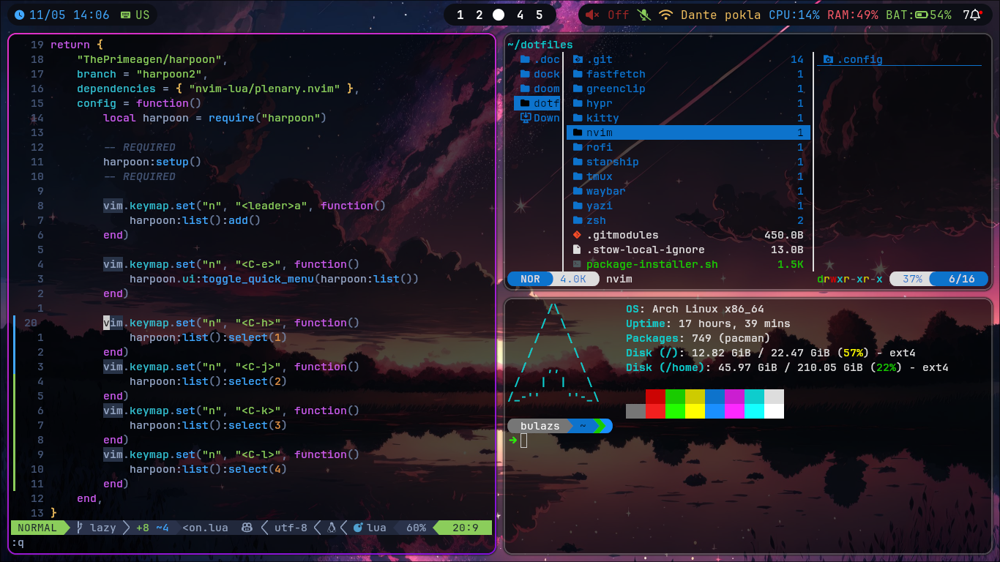

# My personal Arch config



## Installation

### Prerequisites

`git` `stow` 
I only recommend the installation to for fresh profiles or for those who really do know what they are doing.

### Must have packages

```sh
sudo pacman -S --needed git zip unzip make fzf fd less man-db iwd pulseaudio brightnessctl ripgrep vim wget xclip xdg-utils xorg xorg-xinit make base-devel
```

### If you use bluetooth
```sh
sudo pacman -S --needed pulseaudio pulseaudio-bluetooth blueberry
```
### Personal packages
```sh
sudo pacman -S --needed bspwm sxhkd polybar kitty dunst pavucontrol fastfetch rofi rofi-calc rofi-emoji yazi neovim picom feh flameshot starship ttf-jetbrains-mono-nerd
yay -S rofi-greenclip
```
### ZSH
```sh
sh -c "$(wget https://raw.githubusercontent.com/ohmyzsh/ohmyzsh/master/tools/install.sh -O -)"
```

### Config

Clone this repo:
```sh
git clone --recurse-submodules https://github.com/mcbulazs/dotfiles.git
cd dotfiles
```
If you choose to download all of the packages:
```sh
stow */
```
If you want to stow specific packages (name of dir):
```sh
#stow <package_name>
#eg: stow nvim
```
Now everything has been installed just reboot
```sh
sudo reboot now
```

## Packages

### Config specific packages

- `bspwm`
- `sxhkd`
- `polybar` 
- `kitty`
- `dunst`
- `pavucontrol`
- `rofi`
- `yazi`
- `neovim`
- `picom`
- `feh`
- `flameshot`
- `fastfetch`
- `starship`
- `ttf-jetbrains-mono-nerd`

### "Must" have packages

- `git`
- `zip`
- `unzip`
- `make`
- `fzf`
- `less`
- `man-db`
- `iwd`
- `neofetch`
- `pulseaudio`
- `ripgrep`
- `vim`
- `wget`
- `xclip`
- `xdg-utils`
- `xorg`
- `make`
- `base-devel`

